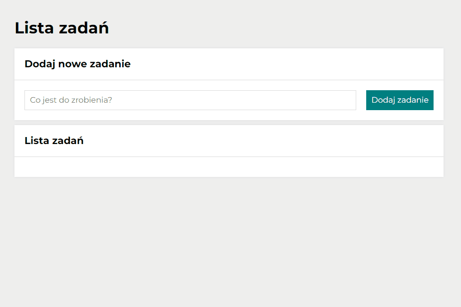

# To do list

## Demo
https://kingapalijewska.github.io/to-do-list/
## Description
This is my first task List Manager. Page is written  in vanilla js with BEM convention. In this website you can add your task list, mark them after finish them, hide them if you want to see just tasks to do or just remove them.
## Technologies
- HTML
- CSS 
- JavaScript
- BEM convention
- ES6+
- Grid
- Media-queries
- Git
- Flex
